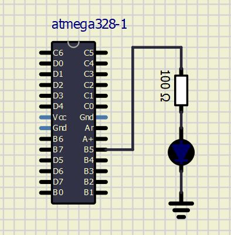

# Lab 1: Martin Knob

Link to your `Digital-electronics-2` GitHub repository:

   [https://github.com/xknobm00/Digital-electronics-2](https://github.com/xknobm00/Digital-electronics-2)


### Blink example

1. What is the meaning of the following binary operators in C?
   * `|`   OR
   * `&`   AND
   * `^`   XOR
   * `~`   NOT
   * `<<`  posun bitu vlevo
   * `>>`  posun bitu vpravo

2. Complete truth table with operators: `|`, `&`, `^`, `~`

| **b** | **a** |**b or a** | **b and a** | **b xor a** | **not b** |
| :-: | :-: | :-: | :-: | :-: | :-: |
| 0 | 0 | 0 | 0 | 0 | 1 |
| 0 | 1 | 1 | 0 | 1 | 1 |
| 1 | 0 | 1 | 0 | 1 | 0 |
| 1 | 1 | 1 | 1 | 0 | 0 |


### Morse code

1. Listing of C code with syntax highlighting which repeats one "dot" and one "comma" on a LED:

```c
/***********************************************************************
 * 
 * Blink a LED and use function from the delay library.
 * ATmega328P (Arduino Uno), 16 MHz, AVR 8-bit Toolchain 3.6.2
 *
 * Copyright (c) 2018-Present Tomas Fryza
 * Dept. of Radio Electronics, Brno University of Technology, Czechia
 * This work is licensed under the terms of the MIT license.
 * 
 **********************************************************************/

/* Defines -----------------------------------------------------------*/
/* The preprocessor will process directives that are inserted into the C
 * source code. These directives allow additional actions to be taken on
 * the C source code before it is compiled into object code. Directives
 * are not part of the C language itself.
 *
 * Preprocessor directives begin with a pound (#) symbol and may have 
 * several arguments. Do NOT put a semicolon character at the end of 
 * directives. This is a common mistake.
 */
#define LED_GREEN   PB5 // AVR pin where green LED is connected
#define SHORT_DELAY 200 // Delay in milliseconds
#define LONG_DELAY 600 // Delay in milliseconds
#define SPACE_DELAY 1000 // Delay in milliseconds
#define RETURN_DELAY 2000
#ifndef F_CPU           // Preprocessor directive allows for conditional
                        // compilation. The #ifndef means "if not defined".
# define F_CPU 16000000 // CPU frequency in Hz required for delay
#endif                  // The #ifndef directive must be closed by #endif

/* Includes ----------------------------------------------------------*/
/* Include another C language file into the current file at the location
 * of the #include statement prior to compiling the source code.
 */
#include <util/delay.h> // Functions for busy-wait delay loops
#include <avr/io.h>     // AVR device-specific IO definitions

/* Function definitions ----------------------------------------------*/
/**********************************************************************
 * Function: Main function where the program execution begins
 * Purpose:  Toggle one LED and use delay library.
 * Returns:  none
 **********************************************************************/
int main(void)
{
    // Set pin as output in Data Direction Register
    // DDRB = DDRB or 0010 0000
    DDRB = DDRB | (1<<LED_GREEN);

    // Set pin LOW in Data Register (LED off)
    // PORTB = PORTB and 1101 1111
    PORTB = PORTB & ~(1<<LED_GREEN);

    // Infinite loop
    while (1)
    {
        // Pause several milliseconds
        _delay_ms(RETURN_DELAY);

		// inscription in Morse code "VUT" (...-  ..-  -)
        PORTB = PORTB ^ (1<<LED_GREEN);
		_delay_ms(SHORT_DELAY);
		PORTB = PORTB & ~(1<<LED_GREEN);
		_delay_ms(SPACE_DELAY);
		
		PORTB = PORTB ^ (1<<LED_GREEN);
		_delay_ms(SHORT_DELAY);
		PORTB = PORTB & ~(1<<LED_GREEN);
		_delay_ms(SPACE_DELAY);
		
        PORTB = PORTB ^ (1<<LED_GREEN);
	   _delay_ms(SHORT_DELAY);
		PORTB = PORTB & ~(1<<LED_GREEN);
	   _delay_ms(SPACE_DELAY);
	   
        PORTB = PORTB ^ (1<<LED_GREEN);
        _delay_ms(LONG_DELAY);
        PORTB = PORTB & ~(1<<LED_GREEN);
        _delay_ms(SPACE_DELAY);	
		  
		
        PORTB = PORTB ^ (1<<LED_GREEN);
        _delay_ms(SHORT_DELAY);
        PORTB = PORTB & ~(1<<LED_GREEN);
        _delay_ms(SPACE_DELAY);	
		
        PORTB = PORTB ^ (1<<LED_GREEN);
        _delay_ms(SHORT_DELAY);
        PORTB = PORTB & ~(1<<LED_GREEN);
        _delay_ms(SPACE_DELAY);		
		
        PORTB = PORTB ^ (1<<LED_GREEN);
        _delay_ms(LONG_DELAY);
        PORTB = PORTB & ~(1<<LED_GREEN);
        _delay_ms(SPACE_DELAY);


        PORTB = PORTB ^ (1<<LED_GREEN);
        _delay_ms(LONG_DELAY);
        PORTB = PORTB & ~(1<<LED_GREEN);
        _delay_ms(SPACE_DELAY);
			 
    }

    // Will never reach this
    return 0;
}
```


2. Scheme of Morse code application, i.e. connection of AVR device, LED, resistor, and supply voltage. The image can be drawn on a computer or by hand. Always name all components and their values!

   
